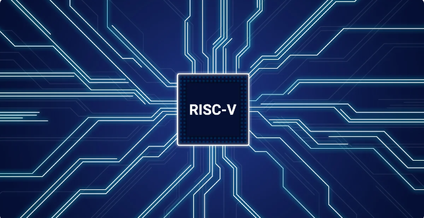
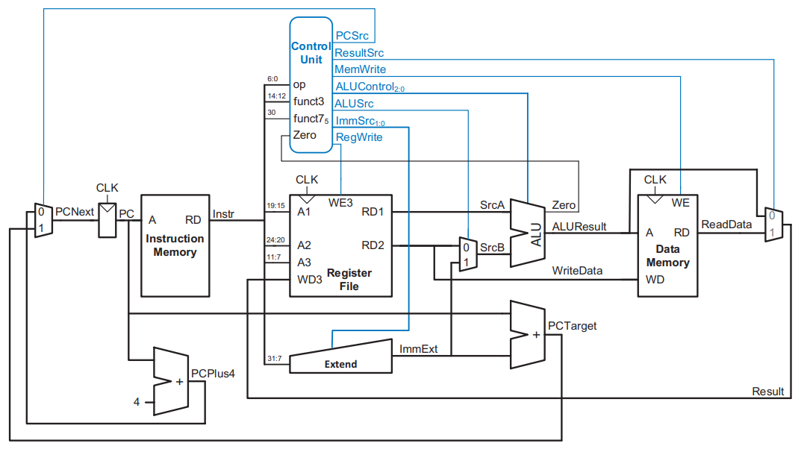

# RISC-V Single Cycle Implementation

 <!-- Add your image link here -->

## Overview
This project is a single-cycle implementation of the RISC-V architecture, which is an open-source instruction set architecture (ISA) based on the principles of Reduced Instruction Set Computing (RISC). The design is enhanced to include various instruction types, ensuring comprehensive functionality and optimal performance. This implementation aims to provide a clear, efficient, and straightforward design, making it ideal for educational purposes and for those interested in understanding the core concepts of the RISC-V architecture.

## Project Structure
- **src/**: Contains the Verilog source files for the RISC-V single-cycle processor.
- **assembly.asm**: An assembly code file used to verify the functionality of the processor.
- **schematics/**: Directory containing schematics of the processor design, including enhancements.
- **snippets/**: Contains snapshots of waveform outputs that verify the functionality of various instructions.
- **docs/**: Project documentation and reference materials.
- **do_file.do**: A DO file provided to increase simulation speed.

## Schematics
### Basic Schematic of RISC-V Single Cycle Processor
 <!-- Add the basic schematic image link here -->

### Enhanced Schematic with J-Type Instructions
.png) <!-- Add the enhanced schematic image link here -->

## Control Unit Mechanism

### ALU Decoder Truth Table

| ALUOp | funct3 | {op5, funct7[5]} | ALUControl | Instruction |
|-------|--------|------------------|------------|-------------|
| 00    |   x    |        x         | 000 (add)  | lw, sw      |
| 01    |   x    |        x         | 001 (subtract) | beq      |
| 10    | 000    | 00, 01, 10       | 000 (add)  | add         |
| 10    | 000    | 11               | 001 (subtract) | sub     |
| 10    | 010    |        x         | 101 (set less than) | slt |
| 10    | 110    |        x         | 011 (or)   | or          |
| 10    | 111    |        x         | 010 (and)  | and         |

### Immediate Handling Table

| ImmSrc | ImmExt | Type | Description                |
|--------|--------|------|----------------------------|
| 00     | {{20{Instr[31]}}, Instr[31:20]} | I  | 12-bit signed immediate |
| 01     | {{20{Instr[31]}}, Instr[31:25], Instr[11:7]} | S | 12-bit signed immediate |
| 10     | {{20{Instr[31]}}, Instr[7], Instr[30:25], Instr[11:8], 1'b0} | B | 13-bit signed immediate |
| 11     | {{12{Instr[31]}}, Instr[19:12], Instr[20], Instr[30:21], 1'b0} | J | 21-bit signed immediate |

### Main Decoder Truth Table

| Instruction | Opcode   | RegWrite | ImmSrc | ALUSrc | MemWrite | ResultSrc | Branch | ALUOp | Jump |
|-------------|----------|----------|--------|--------|----------|-----------|--------|-------|------|
| lw          | 0000011  | 1        | 00     | 1      | 0        | 01        | 0      | 00    | 0    |
| sw          | 0100011  | 0        | 01     | 1      | 1        | xx        | 0      | 00    | 0    |
| R-type      | 0110011  | 1        | xx     | 0      | 0        | 00        | 0      | 10    | 0    |
| beq         | 1100011  | 0        | 10     | 0      | 0        | xx        | 1      | 01    | 0    |
| I-type ALU  | 0010011  | 1        | 00     | 1      | 0        | 00        | 0      | 10    | 0    |
| jal         | 1101111  | 1        | 11     | x      | 0        | 10        | 0      | xx    | 1    |

## How to Use

1. **Clone the Repository**:
   git clone https://github.com/MohamedHussein27/RISC-V-Single-Cycle-Implementation.git
   cd RISC-V-Single-Cycle-Implementation
2. Open the Project:
    Open the project in your preferred Verilog development environment (e.g., Vivado).
3. Run the Simulation:
    Use the provided DO file ("do_file.do") to set up and run the simulation for faster performance.
4. Analyze the Results:
    Check the waveforms in the snippets directory to verify the correct operation of the processor.
5. Modify and Experiment:
    Feel free to modify the Verilog source files or the assembly code (assembly.asm) to test different scenarios and deepen your understanding of RISC-V architecture.

## References

This project was developed with reference to the book Digital [Design and Computer Architecture RISC-V Edition by Sarah L. Harris and David Harris](https://www.amazon.com/Digital-Design-Computer-Architecture-RISC-V/dp/0128200642). This book served as the primary guide for the architecture and design principles applied in this implementation.

## Contact Me!
- [Email](mailto:Mohamed_Hussein2100924@outlook.com)
- [WhatsApp](https://wa.me/+2001097685797)
- [LinkedIn](https://www.linkedin.com/in/mohamed-hussein-274337231)